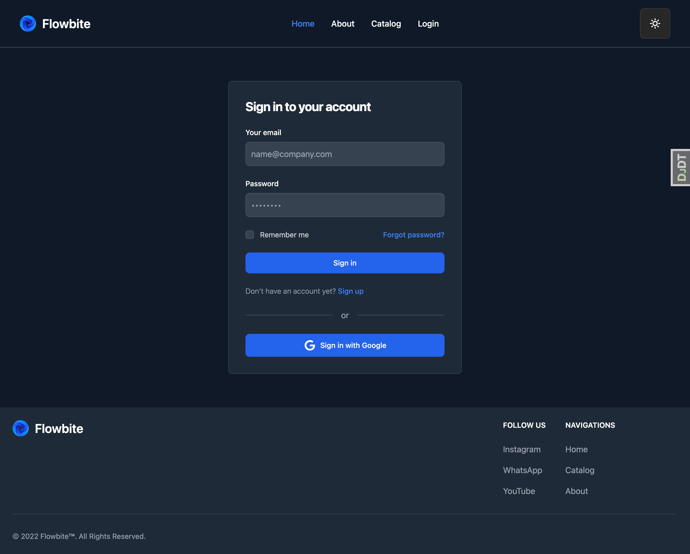
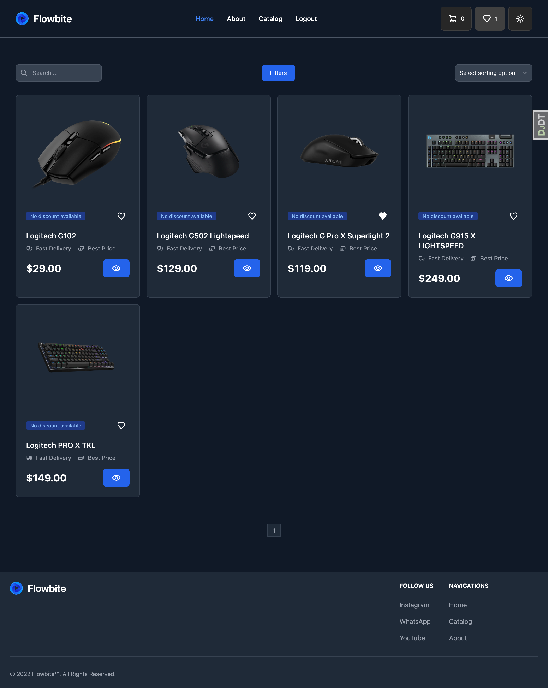
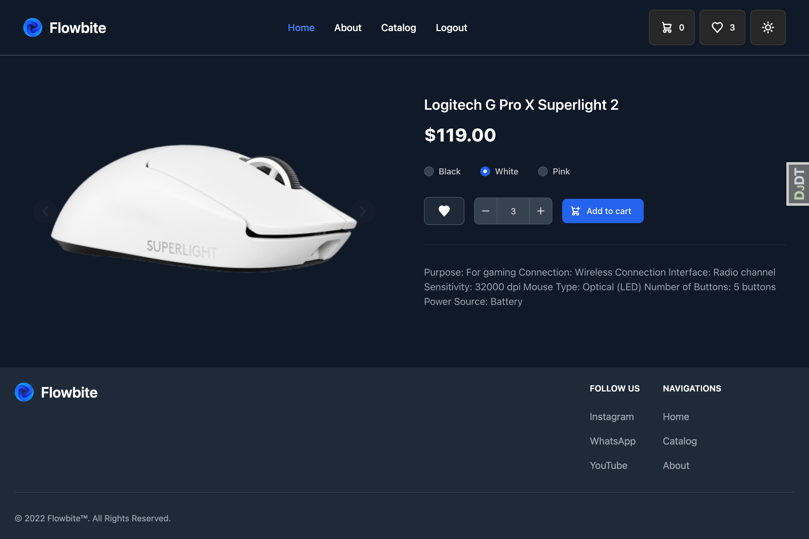
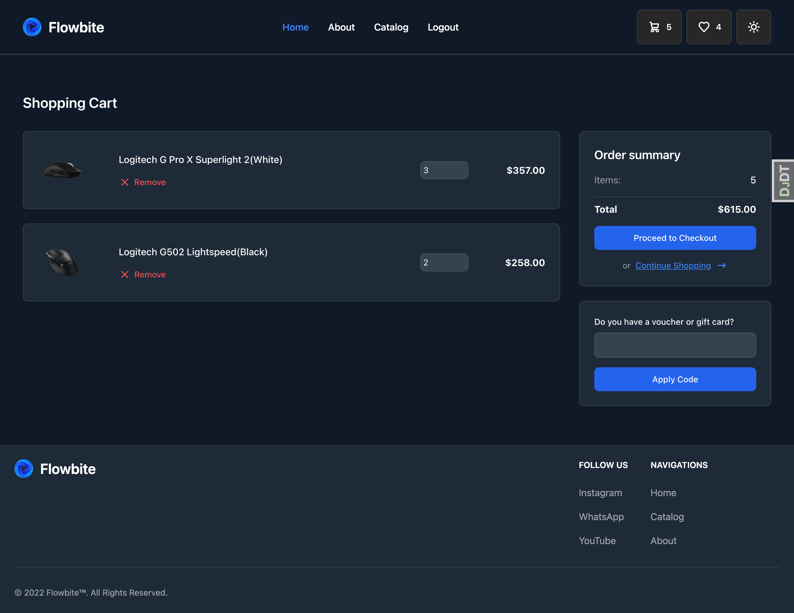
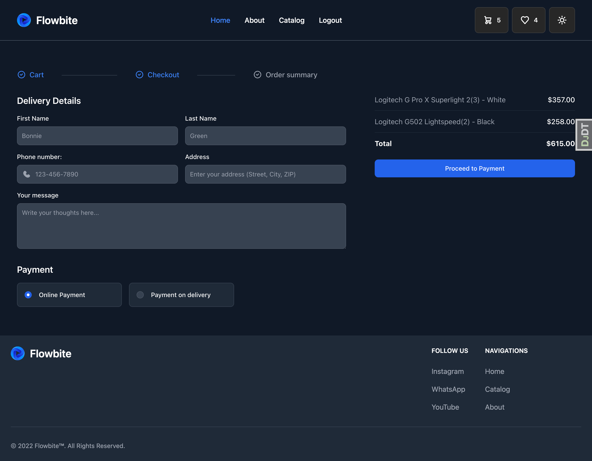
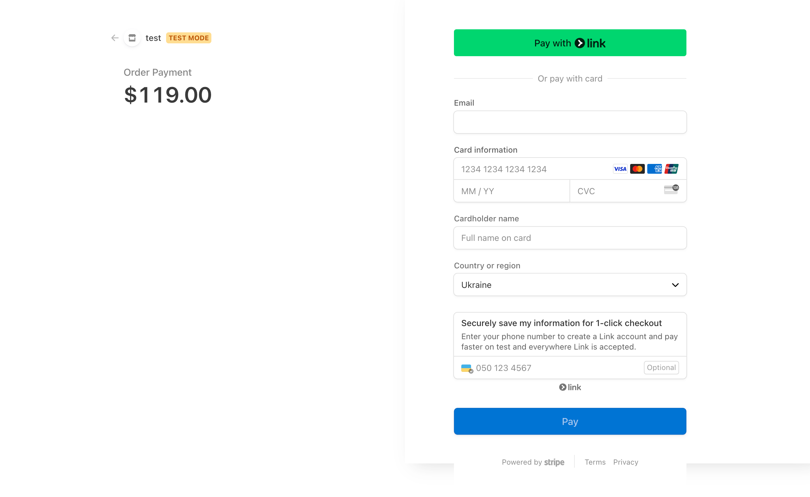

# Commands:

```git clone git@github.com:F1veStar3/django-ecommerce.git```

```docker compose up --build -d```

```docker exec -it my-app-container python manage.py createsuperuser```

# Stack: 

## Front-end
JavaScript, JQuery, CSS, HTML, NPM, tailwindcss, flowbite

## Back-end
Python, Django, Celery, Flower, Allauth, Debug Toolbar, Django Compressor, Pytest

## DataBases
PostgreSQL,Redis

## Additional
Docker/Docker Compose, Git Actions, Stripe

# Images: 

### index 

### login 

### catalog 

### detail 

### cart 

### checkout 

### payment 

